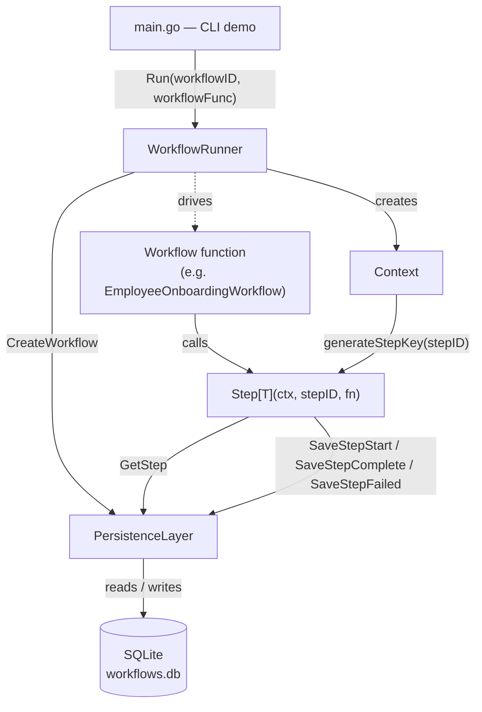
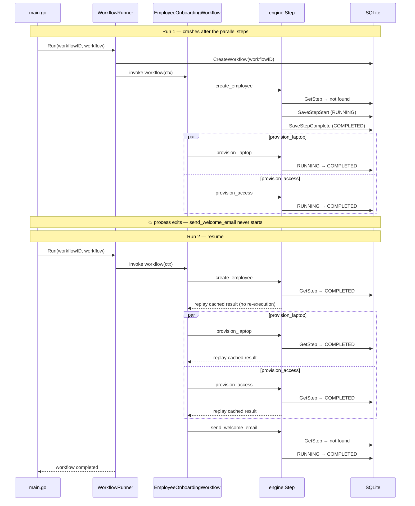

# SafeStep

**A lightweight durable workflow execution engine for Go** — crash recovery, step memoization, and replay-safe execution for multi-step business processes, backed by SQLite.


---

## Table of Contents

- [About the Project](#about-the-project)
- [How to Run](#how-to-run)
- [Architecture](#architecture)
- [Workflow](#workflow)
- [Tech Stack](#tech-stack)
- [Limitations](#limitations)
- [About the Author](#about-the-author)

---

## About the Project

SafeStep is a small, self-contained implementation of the **durable execution** pattern popularized by systems like Temporal and AWS Step Functions — built from scratch in Go to explore how crash-safe, resumable workflows actually work under the hood.

A workflow is just a Go function that calls `engine.Step(...)` for each unit of work. Every step's result is persisted to SQLite before the workflow moves on. If the process crashes mid-run, restarting the workflow **replays completed steps from cache** and only re-executes the work that never finished — no duplicated side effects, no lost progress.

### Key Features

- ⚙️ **Generic `Step[T any]` API** — wrap any function, get automatic durability
- 💾 **SQLite-backed persistence** — step state survives process restarts
- 🔁 **Crash recovery & resume** — interrupted workflows pick up where they left off
- 🧠 **Automatic step memoization** — completed steps replay from cache instead of re-running
- 🧟 **Zombie step detection** — steps stuck `RUNNING` after a crash are safely re-executed
- 🧵 **Parallel step execution** — via `errgroup`, with replay-safe, order-independent step keys
- 🔒 **Thread-safe step key generation** — per-`stepID` sequence counters, safe under concurrency

## How to Run

### Prerequisites

- Go 1.21+
- No external database required — SQLite runs embedded via `modernc.org/sqlite` (pure Go, no CGO)

### Install & Run the Demo

```bash
go mod download
go run .
```

The CLI presents an interactive menu backed by `workflows.db` in the project root:

| Option | Action |
|--------|--------|
| `1` | Run the onboarding workflow normally |
| `2` | Simulate a crash right after Step 1 |
| `3` | Simulate a crash right after the parallel steps |
| `4` | Reset the workflow database |

### Try the Crash Recovery Demo

1. `go run .` → choose `4` to reset the database
2. `go run .` → choose `3` to simulate a crash after the parallel steps
3. `go run .` → choose `1` to resume normally

**Expected result:** `create_employee`, `provision_laptop`, and `provision_access` replay instantly from cache — only `send_welcome_email` actually executes on the final run.

### Run the Tests

```bash
# Full suite, verbose
go test ./... -v

# Clean pass, no cache
go test ./... -count=1 -timeout 3m -v

# Static analysis
go vet ./...

# Race detector
go test ./... -race -v
```

Test coverage includes step memoization, sequence tracking for loops, failure propagation, resume after partial completion, replay correctness under scheduling changes, zombie step recovery, retry after serialization failure, concurrent repeated step IDs, and invalid database path handling.

## Architecture



### Core Components

| File | Responsibility |
|------|-----------------|
| [engine/workflow.go](engine/workflow.go) | `WorkflowRunner` — creates the workflow record and runs the workflow function with a durable context |
| [engine/context.go](engine/context.go) | `Context` — workflow-scoped state and deterministic, thread-safe per-step sequence numbering |
| [engine/step.go](engine/step.go) | Generic `Step[T any]` primitive — memoization, replay, and zombie-step re-execution |
| [engine/persistence.go](engine/persistence.go) | SQLite-backed storage for workflow and step state |
| [examples/onboarding/workflow.go](examples/onboarding/workflow.go) | Demo workflow showing sequential and parallel steps |

### Step Keys & Replay Safety

Every step gets a deterministic key: `<step_id>#<sequence_number>`. Sequence numbers are tracked **per `stepID`**, not globally, so:

- repeated steps in loops get unique, stable keys
- conditional branches stay stable across reruns
- parallel goroutines replay safely even if scheduling order changes between runs

```text
create_employee#1
provision_laptop#1
provision_access#1
send_welcome_email#1
```

### Persistence Model

Each step record stores `workflow_id`, `step_key`, `status`, and `output` (JSON-encoded), with status one of `RUNNING`, `COMPLETED`, or `FAILED`. If a crash happens after `SaveStepStart` but before `SaveStepComplete`, the step is left `RUNNING` — the engine treats that as an interrupted "zombie" step and re-executes it, giving **at-least-once** semantics. Step functions with external side effects should be idempotent.

## Workflow

The bundled example (`examples/onboarding/workflow.go`) models an employee onboarding process: one sequential step, two steps in parallel, then a final sequential step. The sequence diagram below shows a run that crashes after the parallel steps, and how the second run recovers by replaying cached results.



### Minimal Integration Pattern

```go
runner, err := engine.NewWorkflowRunner("./workflows.db")
if err != nil {
    return err
}
defer runner.Close()

err = runner.Run("signup-user-123", func(ctx *engine.Context) error {
    _, err := engine.Step(ctx, "create_user", func() (string, error) {
        return "user-created", nil
    })
    if err != nil {
        return err
    }

    _, err = engine.Step(ctx, "send_email", func() (string, error) {
        return "email-sent", nil
    })
    return err
})
```

This pattern fits real product workflows such as onboarding, billing setup, provisioning, notifications, and webhook handling.

## Tech Stack

| Layer | Technology |
|-------|------------|
| Language | [Go](https://go.dev/) 1.21+ (generics) |
| Persistence | [SQLite](https://www.sqlite.org/) via [`modernc.org/sqlite`](https://pkg.go.dev/modernc.org/sqlite) (pure Go driver, no CGO) |
| Concurrency | [`golang.org/x/sync/errgroup`](https://pkg.go.dev/golang.org/x/sync/errgroup) for parallel step execution |
| Data format | JSON (`encoding/json`) for step output serialization |
| Testing | Go's built-in `testing` package |

## Limitations

SafeStep works well for local durable workflow execution, but it isn't a full production orchestration system yet. It does not currently include:

- Built-in retries with backoff
- Workflow input persistence
- Timeout or cancellation handling
- Multi-process worker coordination
- Schema migrations
- Dead-letter queues
- Observability or admin tooling
- PostgreSQL/MySQL backends

## About the Author

**Manish Sharma**

- LinkedIn: [manishsharma31](https://www.linkedin.com/in/manishsharma31/)
- Email: [manishsharmadota@gmail.com](mailto:manishsharmadota@gmail.com)
